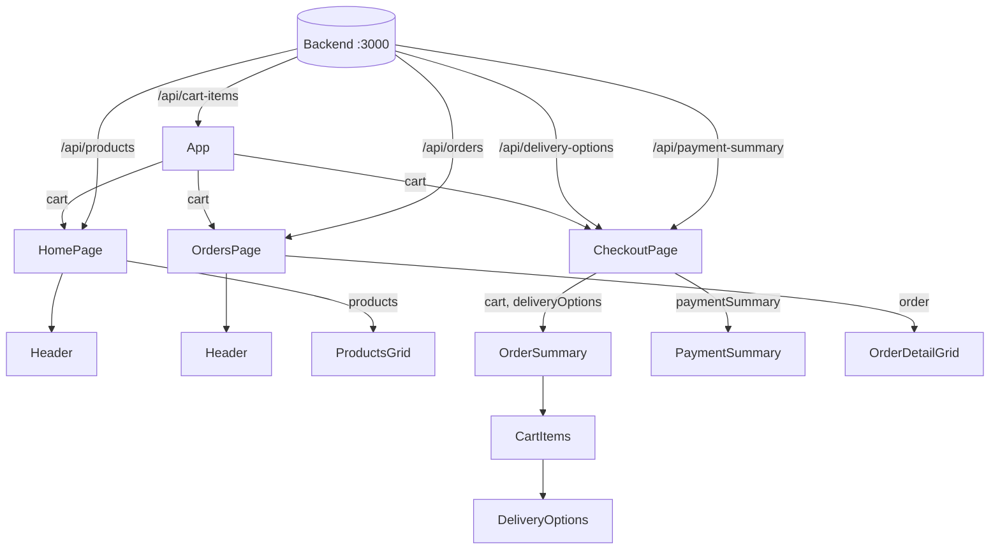

# 2. Architecture

## Startup flow

```
index.html  →  main.jsx  →  <StrictMode> → <BrowserRouter> → <App />
                                                                 │
                                        loads cart once ─────────┤
                                                                 ▼
                                            <Routes>  "/"          → HomePage
                                                      "/checkout"  → CheckoutPage
                                                      "/orders"    → OrdersPage
```

- **`main.jsx`** mounts React into `#root`. `<StrictMode>` runs effects twice in development (that's why requests appear twice in the console); `<BrowserRouter>` enables routing.
- **`App.jsx`** defines the routes and owns the **cart state**.

## Routing

| Path | Component | Notes |
|------|-----------|-------|
| `/` (index) | `HomePage` | Product grid |
| `/checkout` | `CheckoutPage` | Cart review + payment summary |
| `/orders` | `OrdersPage` | Order history |
| `/tracking` | none | Linked from *Track package*, but no route exists yet |

Navigation uses `<Link>` / `<NavLink>` so pages change without a full reload.

## State management

There is no global store. State lives at the lowest component that needs it, using `useState` + `useEffect`:

| State | Lives in | Loaded from | Shared with |
|-------|----------|-------------|-------------|
| `cart` | `App` | `/api/cart-items?expand=product` | all pages (prop `cart`), used by `Header`, `OrderSummary` |
| `products` | `HomePage` | `/api/products` | `ProductsGrid` |
| `deliveryOptions` | `CheckoutPage` | `/api/delivery-options?expand=estimatedDeliveryTime` | `OrderSummary` → `CartItems` → `DeliveryOptions` |
| `paymentSummary` | `CheckoutPage` | `/api/payment-summary` | `PaymentSummary` |
| `orders` | `OrdersPage` | `/api/orders?expand=products` | rendered directly + `OrderDetailGrid` |

The cart is an example of **lifting state up**: it is loaded once in `App` instead of once per page, then passed down as a prop.

Each request is made in a `useEffect(..., [])`, so it runs once when the component mounts.

## Data flow



Data flows **one way, downward**, through props.

## Component tree

```
App
├── HomePage
│   ├── Header
│   └── ProductsGrid
├── CheckoutPage
│   ├── CheckoutHeader
│   ├── OrderSummary
│   │   └── CartItems (one per cart item)
│   │       └── DeliveryOptions
│   └── PaymentSummary
└── OrdersPage
    ├── Header
    └── OrderDetailGrid (one per order)
```

## Conventions used in the code

- One component per file, named export (`export function HomePage`), except `App` (default export).
- Props are destructured in the parameter list: `function Header({ cart })`.
- `react/prop-types` is switched off, so props are not type-checked.
- Lists are rendered with `.map()`; conditional rendering uses `&&`.
- Pages set their document title with a `<title>` element inside the component.
- Each page has its own CSS file, imported in the page component.

## Dev-server proxy

`vite.config.js` forwards `/api` and `/images` to `http://localhost:3000`, so the code only uses relative URLs (`axios.get("/api/products")`). This exists **only in dev**; see `setup-new-computer.md` for running both servers.
